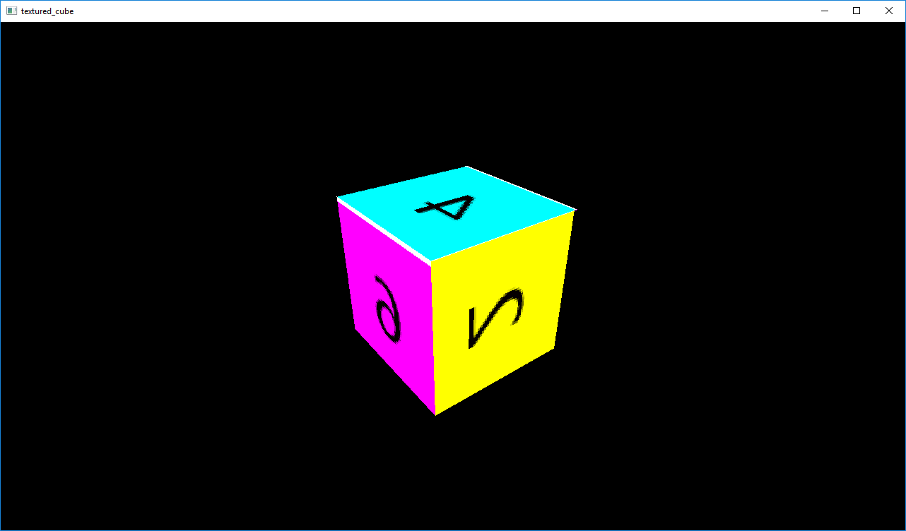

# odin-playground

Gamedev experiments in [Odin](https://odin.handmade.network/).

See also [odin-notes.md](odin-notes.md).

### Prerequisites

* [Odin](https://odin.handmade.network/)
* [odin-gl](https://github.com/vassvik/odin-gl) installed to your Odin "shared" library collection
* [odin-glfw](https://github.com/vassvik/odin-glfw) installed to your Odin "shared" library collection

For more Odin libraries check out [this page](https://github.com/odin-lang/odin-libs).

## [triangle](triangle/triangle.odin)

Getting setup with GLFW, loading shaders, and drawing a triangle. Starting from translating [this tutorial](http://www.opengl-tutorial.org/beginners-tutorials/tutorial-2-the-first-triangle/).

## [matrices](matrices/matrices.odin)

Adds model, view, and perspective matrices.

## [cube](cube/cube.odin)

Drawing a cube with vertex colors.

## [textured_cube](textured_cube/textured_cube.odin)

New prerequisite: [stb_image](https://github.com/vassvik/odin-stb/blob/master/stbi/stb_image.odin).

Loading an image with `stb_image` and drawing a textured cube.

