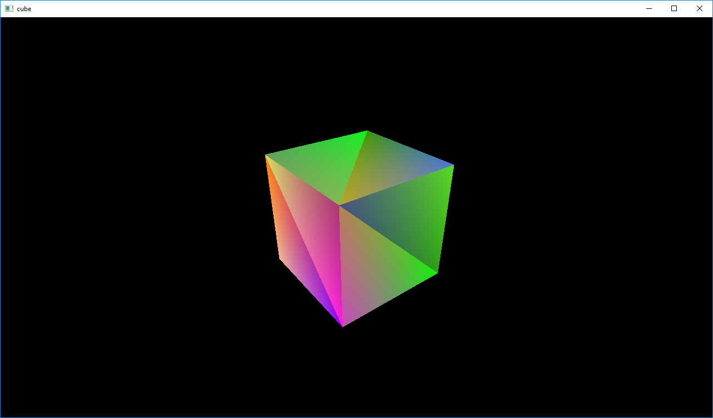

# odin-playground

Gamedev experiments in [Odin](https://odin.handmade.network/).

## [triangle](triangle/triangle.odin)

Getting setup with GLFW, loading shaders, and drawing a triangle. Starting from translating [this tutorial](http://www.opengl-tutorial.org/beginners-tutorials/tutorial-2-the-first-triangle/).

## [matrices](matrices/matrices.odin)

Adds model, view, and perspective matrices.

## [cube](cube/cube.odin)

Drawing a cube with vertex colors.

